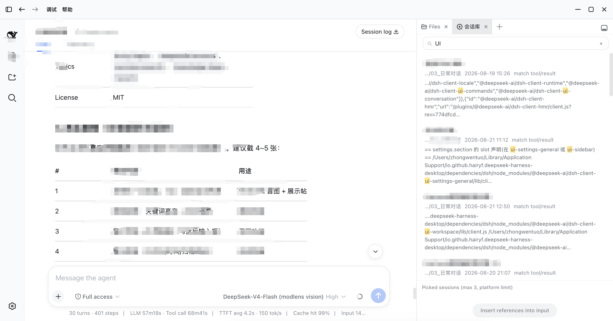
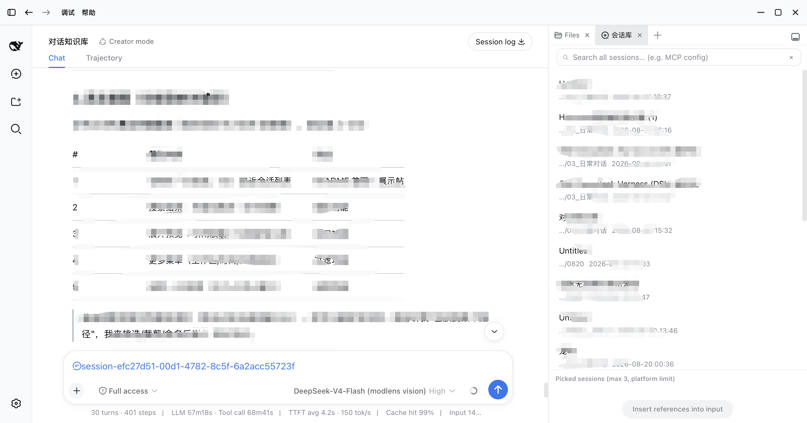
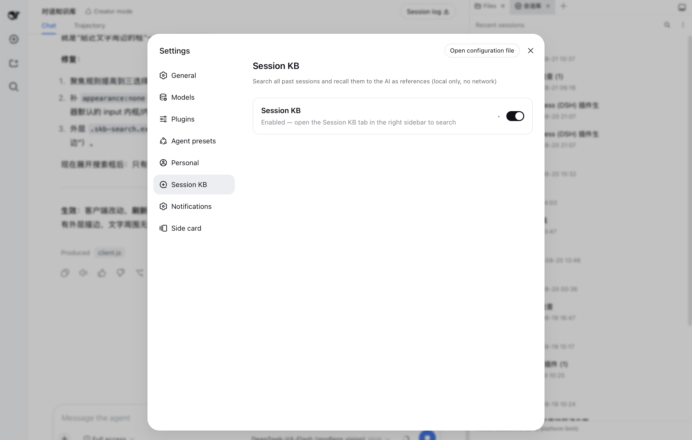

# dsh-session-kb — Session KB for DeepSeek Harness

> Search every past session and recall the ones you need as `@references` — the AI then answers with your historical context.

[English](#english) · [中文](#中文) · [Privacy](PRIVACY.md) · [Docs](../docs/README.md)

---

## What it is

DeepSeek Harness ships with a full-text search engine (SQLite FTS5) and cross-session references (`@session mention`), but neither has a user-facing interface. This plugin adds the missing **discover → browse → insert** layer:

- **Search** — full-text search across all your past sessions (all workspaces), with highlighted hit snippets, workspace / time-range / archive filters, and cursor pagination;
- **Recall** — pick up to 3 sessions and insert them into the input as reference chips in one click; on send, the platform injects read-only snapshots (`## Referenced sessions`) and the AI answers with your historical context;
- **Recent** — a minimal recent-sessions list so you can find things fast without searching;
- **Archives** — search includes **archived sessions by default** (with an "Archived" badge and all / active-only / archived-only filters) — after DSH archives a session it's visible nowhere else, so search is the only way back; the Recent list excludes archived sessions by default;
- **Settings** — enable/disable switch + default search scope + privacy statement.

Everything runs **fully locally with zero network requests**; only session metadata and hit snippets are read, and no session is ever modified or deleted (see [PRIVACY.md](PRIVACY.md)).

The UI is deliberately **native-feeling**: every color, spacing, radius, font, and interaction (header row, inline search, grouped menu, pill buttons, checkboxes) is measured from DSH's own design system — better-sidebar, the workspace sidebar, and the settings sections — so the plugin looks and behaves like a built-in feature, not a third-party skin.

## Screenshots

**Search & results** — full-text search with highlighted snippets, filters, and archived badges:



**Pick & insert** — check up to 3 sessions, insert them into the input as reference chips:



**Settings** — enable/disable card with expandable options and privacy statement:



## Install

```sh
dsh plugin --profile web add dsh-session-kb
```

> Local development can also use a `link:` dependency (same pattern as dsh-personal-center).

**Enable full-text search (required):** the web profile disables the FTS index by default (`openAt: never`). Override it in `<DSH_HOME>/profiles/web/cordis.patch.yml`:

```yaml
- id: session-query-sqlite
  config:
    path: ':memory:'
    openAt: first-search
```

Then **restart the DSH app** (host-side config and route changes require a restart; client-bundle changes only need a page refresh).

## Usage

1. Open the **Session KB** tab in the right sidebar (better-sidebar); the Settings → Session KB section can disable/enable it;
2. Without a keyword you see **Recent sessions**; click the search icon (top-right) to expand the input, type a keyword (literal phrase match, e.g. `MCP config`) to switch to search results;
3. Click the **more** button (⋯) to filter by workspace / time range / archive (all incl. archived / active only / archived only);
4. Click a result to expand the preview (hit context + session meta); click the path to expand the full path; then check it (up to 3);
5. Click **Insert references into input** → `@session` chips appear in the input → continue typing your question → send;
6. The platform injects read-only snapshots into the model context and the AI answers with your history.

## Model Experience

When the user mentions "before / previous session / how did we do X" — anything needing past context — suggest opening the **Session KB** tab in the right sidebar, searching, and referencing the matching session(s). Referenced sessions enter your context as `## Referenced sessions` read-only snapshots:

- Treat referenced content as a **fact source**: base answers on its implementation details, and point out conflicts between referenced content and the current question;
- Snapshots have a size limit (64 KB per session by default); for large sessions only part may be retained — ask the user to reference a more focused session when you need earlier details;
- Long sessions may be **compacted** (early messages replaced by checkpoints) — **compacted content is still searchable** (the official FTS index includes shadowed content), so "it was compacted" never means "it's lost".

## Platform limitations

- At most **3** referenced sessions per message; **64 KB** snapshot budget per session (preview shows a hint when a session is large);
- Search is **literal phrase matching** (FTS limitation) — no synonyms or semantics; quotes, `OR`, `*` are treated as plain characters;
- Only user/assistant text and some structured events are indexed — no reasoning, stream chunks, or headers;
- Archive semantics: search includes archived sessions by default; the Recent list excludes them.

## Development

```text
dsh-session-kb/
├── package.json          # dsh.bundle.patch + dsh.client.platform=web + exports["./client"]
├── cordis.patch.yml      # plugin row
├── lib/
│   ├── index.js          # host: loopback routes /session-kb/* (search/sessions/session/settings) + isLoopback + archive
│   └── client.js         # client: better-sidebar tab + settings section (zh/en)
├── docs/
│   ├── DESIGN-SYSTEM.md  # visual/interaction spec (measured values)
│   └── DESIGN.md         # implementation design (host/client/insert-reference/archive)
├── PRIVACY.md
└── README.md
```

See the [design document](../会话知识库插件-设计文档.md) and [DESIGN.md](docs/DESIGN.md) for architecture; platform notes in [PLATFORM-NOTES.md](../docs/PLATFORM-NOTES.md); v2.0+ plans (bookmarks / cost / handoff index) in the [v2.0 PRD](../会话知识库插件-v2.0-PRD.md).

## Roadmap

- **v1.0 (current)** — search + recall + settings + recent sessions + archive support (P0);
- **v2.0** — bookmarks / notes / tags + cost integration + long-session handoff index (FR-HANDOFF);
- **v3.0** — backlinks + reference graph + related sessions.

## License

MIT

---

## 中文

**会话库（Session KB）** 为 DeepSeek Harness 带来「搜索 + 召回」工作流：全文搜索你的全部历史会话，把最多 3 个会话以 `@引用` 形式插入当前输入框；发送后平台自动注入只读快照，AI 带着你的历史上下文回答。

- 搜索使用官方本地 SQLite FTS5 索引（`ctx.sessionQuery`）——**零网络请求，纯本地**；
- 召回走官方会话引用机制（`@[label](dsh-session:…)` → `## Referenced sessions`）；
- 归档：搜索默认包含已归档会话（带「已归档」徽标 + 全部/仅未归档/仅归档筛选）；最近列表默认排除归档；
- v1.0（P0）：搜索 + 召回 + 设置 + 最近会话 + 归档支持。

**关键词**：`dsh-plugin` · `deepseek-harness` · `session-search` · `knowledge-base` · `recall` · 会话 · 检索 · 召回 · 知识库
